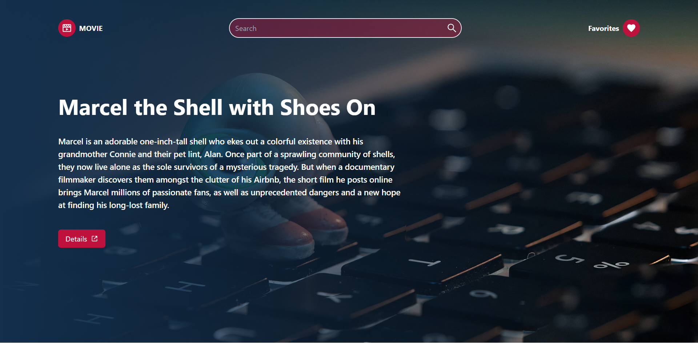

# Movie App - [Live Link](https://rm-movieapp.netlify.app/) :point_left: 

This is a simple Movie App that is built using React and makes use of the [TMDB API](https://www.themoviedb.org/documentation/api).

## Features

1. MovieList: Displays a list of movies(popular, top rated, latest).
2. MovieDetails: Displays details of a movie.
3. Favorites: Displays a list of favorite movies.
4. Search: Search for movies.

## Installation

To get started with this project, follow these steps:

1. Clone this repository to your local machine using git clone https://github.com/RaminMikayilov/Movie-app.git
2. Navigate to the project directory using cd movie-app
3. Install the necessary dependencies using npm install
4. Start the development server using npm run dev(because I use vite react)

The app should now be running on localhost

## Technologies Used

- React
- Redux Toolkit
- Redux Thunk
- Tailwind CSS

## Contributing

If you find any bugs, please feel free to create an issue or submit a pull request.

If you would like to contribute to the project, please fork the repository and create a pull request.

## License

This project is licensed under the MIT License - [MIT](https://choosealicense.com/licenses/mit/)
